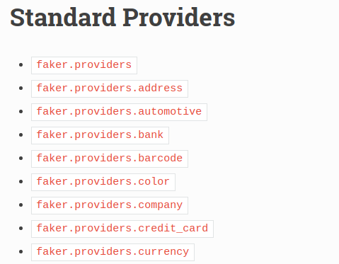
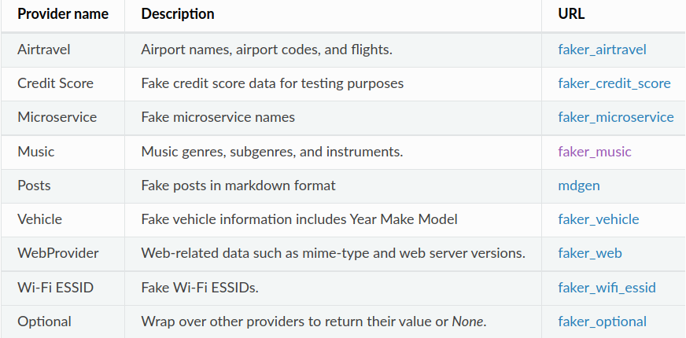
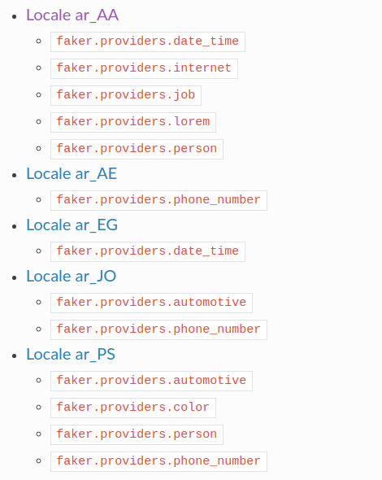

# Faker
<!-- .slide: data-background="#81ceff" -->

111111小组

金可成 杨旭建 匡科帆

Notes:
大家好,我们是`111111`小组
今天来介绍一个名为faker的包.

faker是一个轻便简单的python包, 提供了生成各种类型假数据的便利

---

## Introduction
<!-- .slide: data-background="#81ceff" -->

Faker 是一个生成各种假数据的 Python 包

Notes:
Faker is a Python package that generates fake data for you. Whether you need to bootstrap your database, create good-looking XML documents, fill-in your persistence to stress test it, or anonymize data taken from a production service, Faker is for you.

---

## Why Faker
<!-- .slide: data-background="#81ceff" -->

尽管我们有很多生成随机数据的方法，但这些方法不够方便

---

<!-- ### Features -->
<!-- .slide: data-background="#81ceff" -->
- 不同语言 <!-- .element: class="fragment" data-fragment-index="1" -->
- 种类丰富 <!-- .element: class="fragment" data-fragment-index="2" -->
- 自定义 <!-- .element: class="fragment" data-fragment-index="3" -->

Notes:
Faker

---

## Installation

<!-- .slide: data-background="#FFDB80" -->
```bash
pip install Faker
conda install Faker
```

Notes:
直接通过pip安装或者通过conda安装.

---

## Basic Usage

<!-- .slide: data-background="#81ceff" -->

---

通过`faker.Faker()` 创建一个 faker data 生成器

访问其相应属性来获得不同类型的数据
<!-- .slide: data-background="#81ceff" -->

---

```python
from faker import Faker
fake = Faker()
```
<!-- .element: class="fragment" data-fragment-index="1" -->

```python [1-3|5-6|8-13]
fake.name()
# Zachary Mcdonald
# Edward Potter

fake.address()
# 9344 Sherry Loop Apt. 236

fake.text()
# Administration seem fight person politics.
# Drug that very view sister federal ask.
# Picture option probably increase check.
# Likely smile him young. Bill such owner hear likely 
# sell late.
```

<!-- .slide: data-background="#FFB080" -->

---

## Localization

通过接收 `locale` 参数, Faker 能够生成不同语言的假数据

<!-- .slide: data-background="#81ceff" -->

---

<!-- .slide: data-background="#FFDB80" -->
```python [1|3-4|5-10]
fake = Faker('zh_CN')

fake = Faker(['zh_CN', "ja_JP", "en_US"])
[print(fake.name()) for _ in range(10)]
# Caitlin White
# 全春梅
# Deborah Kelley
# 田中 美加子
# 袁斌
# ...
```

Notes:

---

## Providers

- Standard Providers <!-- .element: class="fragment" data-fragment-index="1" -->

- Community Providers <!-- .element: class="fragment" data-fragment-index="2" -->
  
- Localized Providers <!-- .element: class="fragment" data-fragment-index="3" -->

<!-- .slide: data-background="#81ceff" -->

Notes:
Faker()是一个代理类, 委托各种Providers类来根据不同的locale产生不同类型的数据

------

### Standard
<!-- .slide: data-background="#81ceff" -->



------

### Community
<!-- .slide: data-background="#81ceff" -->



------

### Localized
<!-- .slide: data-background="#81ceff" -->



---

## User-Defined Provider
<!-- .slide: data-background="#81ceff" -->

---

## How to create a Provider
<!-- .slide: data-background="#81ceff" -->

---

```python [1-2|4-7|9-10|12-14]
# first, import a similar Provider or use the default one
from faker.providers import BaseProvider

# create new provider class
class MyProvider(BaseProvider):
    def foo(self) -> str:
        return 'bar'

# then add new provider to faker instance
fake.add_provider(MyProvider)

# now you can use:
fake.foo()
# 'bar'
```

<!-- .slide: data-background="#FFB080" -->

---

### Dynamic provider
<!-- .slide: data-background="#81ceff" -->
Dynamic providers 能够从外部代码读入需要随机的数据

---

```python [1|3-6|8-15]
from faker.providers import DynamicProvider

medical_professions_provider = DynamicProvider(
     provider_name="medical_profession",
     elements=["dr.", "doctor", "nurse", "surgeon", "clerk"],
)

fake = Faker()

# then add new provider to faker instance
fake.add_provider(medical_professions_provider)

# now you can use:
fake.medical_profession()
# 'dr.'
```

<!-- .slide: data-background="#FFB080" -->

---

## Command-line usage

```shell
faker [-h] [--version] [-o output]
      [-l {bg_BG,cs_CZ,...,zh_CN,zh_TW}]
      [-r REPEAT] [-s SEP]
      [-i {package.containing.custom_provider otherpkg.containing.custom_provider}]
      [fake] [fake argument [fake argument ...]]
```

<!-- .slide: data-background="#FFB080" -->

---

```shell
$ faker address
2344 Long Highway
Maryborough, DE 01110

$ faker -l zh_CN address
福建省兴城市沈北新吴街w座 153286

$ faker -l zh_CN -r=3 -s="," address
江西省玉英市安次刘街w座 355329,
北京市玉华市永川崔路K座 444095,
贵州省辛集县涪城金路N座 895691,

$ faker profile ssn,birthdate
{'ssn': '667-77-9481', 'birthdate': datetime.date(1952, 10, 21)}

```

<!-- .slide: data-background="#FFB080" -->

---

## 谢谢观看
<!-- .slide: data-background="#81ceff" -->
